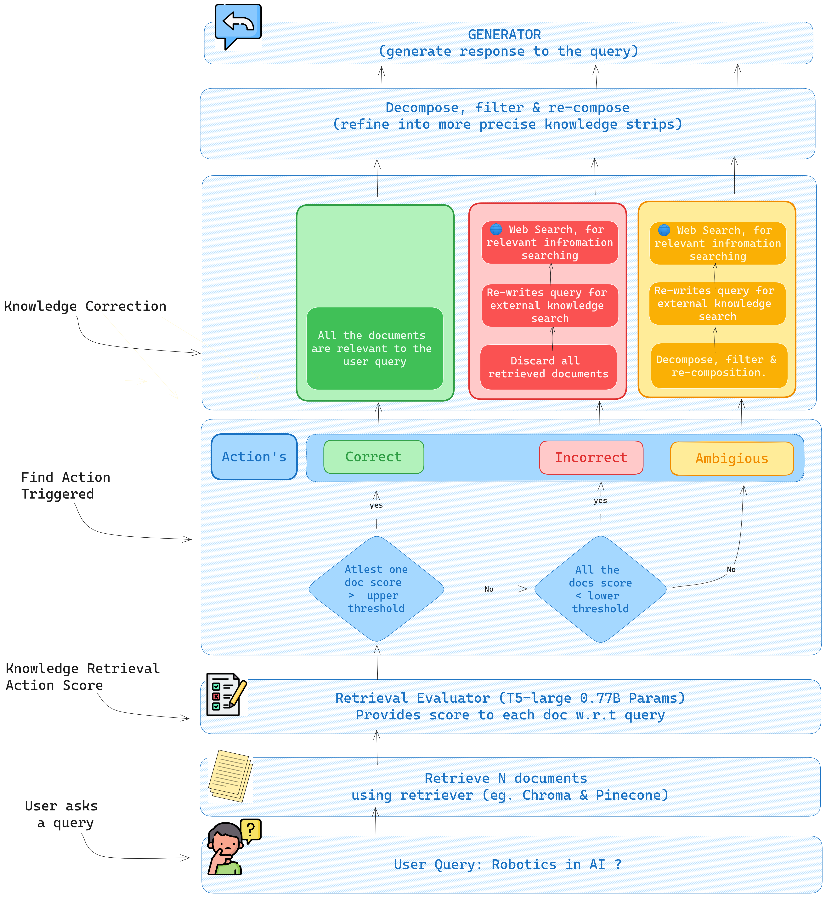

# Superpowers of open source LLM's with Corrective RAG

Large language models are very good in generating responses but the main problem comes when they start to hallucinate and most of the times its corrected by a tool called RAG (Retrieval Augmented Generation). RAG provides the relevant context/documents to the LLM's and wallah we are good to go right ? Well not quite there as there is no ensurity that the context is relevant to the user query. Here CRAG comes into play to rescue and provide a corrective measure for RAG's which not many people are working on.

# What is Corrective Rag.

- In a very laymans term it is very much like other RAG techniques but the only distinguishing factor comes in from its corrective nature. It asses all the retrieved documents relevancy and based upon that, triggers different actions for knowledge correction. It tries to correct the retrieved documents upon looking into them and tries to refine the retrieved documents relevance by either using its parameterized memory or using extrnal knowledge base (like Wikipedia).

- In this framework, the input to models is augmented by prepending relevant documents that are retrieved from an external knowledge corpus. While RAG serves as a practicable complement to LLMs, its effectiveness is contingent (dependent on or conditioned by something else) upon the relevance and accuracy of the retrieved document.
- **large-scale web searches** are utilized as an extension for augmenting the retrieval results. Besides, a decompose-then-recompose algorithm is designed for retrieved documents to selectively focus on key information and filter out irrelevant information in them.
- CRAG is **plug-and-play** and can be seamlessly coupled with various RAG-based approaches.
- This paper makes the first attempt to explore and design corrective strategies for RAG to improve its robustness of generation. Corrective Retrieval Augmented Generation (CRAG) to improve the robustness of generation.

# Comparison with existing RAG Techniques

- Self-RAG is proposed to selectively retrieve knowledge and introduce a critic model to decide whether to retrieve. It is evaluated to performed where LM generates output given the query prepended with the top retrieved documents using the vectorstore retriever where query is prepended with retrieved documents. There are Several public instruction-tuned LLMs, including LLaMA2-7B, 13B, Alpaca-7B,13B, as well as LLaMA2–7B instruction-tuned in Self-RAG.

- Self-RAG has been tuned using the LLaMA2 on the instruction-tuning data containing several sets of reflection tokens which were labelled by GPT4.

- Advanced Rag such as [SAIL (search-augmented instruction learning)](https://arxiv.org/abs/2305.15225)\*\* is an [NLI](https://www.sbert.net/docs/pretrained-models/nli-models.html) model to identify the irrelevant context and improve robustness. It has been used to instruct-tune an LM on the Alpaca instruction-tuning data with top retrieved documents inserted before instructions. In addition, toolformer is used for pretrained to call APIs such as Wikipedia.

# CRAG Steps

- Aks user a query `X`.
- A Retriever does a similarity search between query and documents from vector store (Chroma, Pinecone or any other vector store) for querying top N similar documents `D= {d1, d2,...,dN}` (authors used N=10).
- A lightweight retrieval evaluator `E` ([Finetuned T5-large](https://huggingface.co/google-t5/t5-large)) is designed to assess the overall quality of retrieved documents for a query. This serves as a crucial component in RAG, contributing to informative generation by reviewing and evaluating the relevance and reliability of the retrieved documents.
- A lightweight retrieval evaluator is designed to assess the overall quality of retrieved documents for a query and then a confidence degree scores `S = {s1, s2,...,sN}` is quantified.
- Based on scores `S` different knowledge retrieval actions of `{Correct, Incorrect, Ambiguous}` can be triggered which is our confidence `C`. To decide when to take these action an `upper` and `lower` bound has been set as a threshold.

- For `C`= Correct, the confidence score of at least one retrieved document is higher than the upper threshold. The retrieved documents `D` will be refined into more precise knowledge strips filtered documents `K` using `decompose-then-recompose` stratergy as relevant documents can still have noisy data.

- The **decompose-then-recompose** algorithm ensures the refinement of retrieved information, optimizing the extraction of key insights and minimizing the inclusion of non-essential elements. The algorithm is meticulously crafted throughout the retrieval and utilization process.

- For `C` = incorrect action, the confidence scores of all retrieved documents are below the lower threshold. A Query Rewriter `W` is used to rewrite query for into queries composed of keywords by ChatGPT to mimic the daily usage of search engine. A **large-scale** web searches are integrated as a strategic extension and later on decompose-then-recompose will be performed to get more filtered documents `K`.

- For `C` = Ambigious action, the evaluator `E` is not confident in its judgment, both types of processed knowledge in Correct and Incorrect are combined to complement each other and later on decompose-then-recompose will be performed to get more filtered documents `K`.

> Note: Web search is introduced since retrieval from static and limited corpora can only return sub-optimal documents in terms of scope and diversity.

- Then any arbitrary LLM generator model `G` will be used to predict response `y` to user query `X` given filtered documents `K`.

# Extra for CRAG

- Authors also cited the results of retrieval-augmented baselines trained with private data: Ret-ChatGPT and Ret-LLaMA-chat, which deploy the same augmentation technique above, as well as perplexity.ai, an InstructGPT-based production search system.

- Compared with the critic model of Self-RAG that instruction-tuned LLaMA-2 (7B), the evaluator designed in CRAG demonstrates the advantages of being quite lightweight (0.77B). The accuracy of the retrieval evaluator undeniably plays a pivotal role in shaping the overall system performance, as it influences the outcomes of subsequent processes.

- Unlike **CRAG** most conventional RAG approaches indiscriminately incorporate the retrieved documents, regardless of whether these documents are relevant or not. These documents have a considerable portion of the text which are often non-essential for generation and should not have been equally referred to and involved in RAG.

> To facilitate others to reproduce our results, we will publish all source code later

# Who can hurt LLM performance

- As many studies found either outdated information or incorrect knowledge that is activated would seriously result in hallucinations. Large-scale unregulated training data collection, low proportion of high-quality sampling data, imperfection of data allocation in the input space, and many other realistic factors could impact the LLMs and exacerbate the problems.

- It is obvious that the lack of accurate and specific knowledge can lead to misleading or even inaccurate generation, which will severely hurt the experience of users in most practical applications.

# Experiments performed

Below experiements were evaluated on the PopQA dataset by removing individual knowledge utilization operations of document refinement, search query rewriting, and external knowledge selection. The performance of the final system degraded no matter which knowledge utilization operation was removed.

- **Removing document refinement:** The original retrieved documents are directly fed to the following generator, as in most existing works.

- **Removing search query:** The questions are not rewritten into queries consisting of keywords during knowledge searching.

- **Removing knowledge selection:** The searched content of web pages are all regarded as the external knowledge without selection.

# For Future lookouts

- Fine-tuning a retrieval evaluator is inevitable and worth looking into creating more reliable retriever for specific needs.
- Potential bias introduced by web searches is also worth concern. The quality of internet sources can vary significantly, and incorporating such data without enough consideration may introduce noise or misleading information to the generated outputs.
- In addition, in some long-text generation tasks, external knowledge is needed more than once, and when to retrieve should be concerned. People are actively anticipate future content and decide when and what to retrieve in long-form generation. See [Active Retrieval Augmented Generation](https://aclanthology.org/2023.emnlp-main.495/).
- The heavy reliance of generation on the retrieved knowledge raises significant concerns about the model's behavior and performance in scenarios where retrieval may fail or return inaccurate results

# Resources:

- SAIL: Search-Augmented Instruction Learning: https://arxiv.org/abs/2305.15225
- Alpaca: A Strong Replicable Instruction-Following Model: https://crfm.stanford.edu/2023/03/13/alpaca.html
- Collab: https://colab.research.google.com/drive/1LEqr-cxs9gjXZtKVQ_M_sESGDHeoxLQf#scrollTo=eSgVWCq_oav7
- CRAG: Corrective Retrieval Augmented Generation: https://arxiv.org/abs/2401.15884
- Active Retrieval Augmented Generation: https://aclanthology.org/2023.emnlp-main.495/
